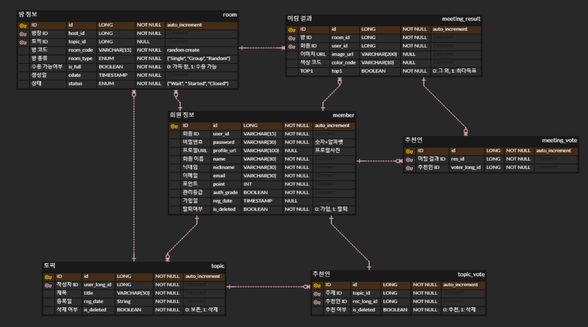
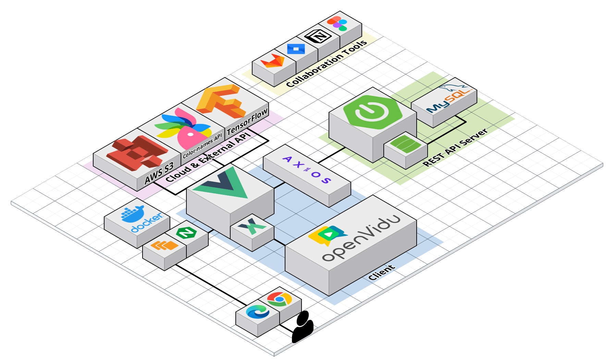

<br>

## 목차
[1. 프로젝트 개요](#1-프로젝트-개요)
- [프로젝트 목표](#1-프로젝트-목표)
- [주요 기능](#2-주요-기능)
- [전체 일정](#3-전체-일정)
- [구성원](#4-구성원)


[2. 프로젝트 설계](#2-프로젝트-설계)
- [Figma](#1-figma)
- [개발환경](#2-개발환경)
- [ERD](#3-erd-link)
- [아키텍처](#4-아키텍처)
- [REST API](#5-rest-api-link)

[3. 프로젝트 소개](#3-프로젝트-소개)

[4. 프로젝트 파일 구조](#4-프로젝트-파일-구조)

[5. 프로젝트 산출물](#5-프로젝트-산출물)

<br>

## 1. 프로젝트 개요
  ### 1) 프로젝트 목표
    WebRTC를 활용하여 다양한 사람들과 함께 소통하며 개인의 얼굴, 분위기와 어울리는 색상을 찾을 수 있는 서비스 개발
  ### 2) 주요 기능
  | **기능** | **내용** |
  | :--: | :-- |
  | 기능 1 | 자신의 얼굴 주변에 여러 색상을 배치해보면서 어울리는 색상 비교 |
  | 기능 2 | 나만의 색상 팔레트에 원하는 색상 담기 |
  | 기능 3 | 친구, 랜덤, 개인으로 구분된 미팅 방에 입장하여 서로 소통하며 색상 비교 및 선택 |
  | 기능 4 | 어울리는 색상을 찾기 위해 투표 가능(토너먼트 / 원 픽) |
  | 기능 5 | 마이페이지에서 최근 참여했던 미팅에서 선택했던 팔레트 내역 확인 가능 |
  ### 3) 전체 일정
  ### 2022. 07. 05. ~ 2022. 08. 19. (7주)
  | 기 간 | 내 용 |
  | :---: | :--- |
  | 07. 05. ~ 07. 19. | 아이디어 선정 및 사용자 요구사항 분석 |
  | 07. 15. ~ 07. 27. | 요구사항 정의서 작성, Mock-up / ERD / REST API 설계 |
  | 07. 25. ~ 07. 29. | 회원가입, 로그인 등 기본 서비스 개발 |
  | 07. 30. ~ 07. 15. | OpenVidu를 이용한 화상 미팅 서비스 개발 / Face-Detection 적용 / Rest API 서버 개발 |
  | 08. 16. ~ 08. 19. | 서비스 배포 및 유지보수 |
  ### 4) 구성원
  **SSAFY 7th 대전캠퍼스 B208**
  |   Name(Git)   | [송다경](https://github.com/sa11k/) | [김민영](https://github.com/minyule) | [김찬일](https://github.com/chanilkim) | [이한기](https://github.com/hanenergy) | [강민성](https://github.com/pfcskms1997) | [오정환](https://github.com/Ojeonghwan) |
  | :------: | :------: | :------: | :------: | :------: | :------: | :------: |
  | Github | <a href="https://github.com/sa11k"></a> | <a href="https://github.com/minyule"></a> | <a href="https://github.com/chanilkim"></a> | <a href="https://github.com/hanenergy"></a> | <a href="https://github.com/pfcskms1997"></a> | <a href="https://github.com/Ojeonghwan"></a> |
  | Position | :crown: / Frontend | Frontend | Frontend | Frontend | Backend | Backend |

</br>

## 2. 프로젝트 설계
   ### 1) Figma [(link)](https://www.figma.com/file/0pfzHeX6s46qoyzQOuOdr2/%EA%B9%94%EB%A7%9E%EC%B6%A4?node-id=226%3A767)
   ### 2) 개발환경
   | Backend | Frontend | CI/CD | Collaboration Tools |
   | :------ | :------- | :---- | :----- |
   | Java Open-JDK zulu 8.33.0.1 | Vue 2.6.14 | AWS EC2 | GitLab |
   | SpringBoot Gradle 2.7.2 | Vue/cli 5.0.8 | Ubuntu 20.04 LTS | Jira |
   | Spring Data JPA | Vuex 3.6.2 | Docker 20.10.17 | Webex |
   | Lombok | Vue Router 3.5.1 |  | Notion |
   | Swagger 2.9.2 | OpenVidu 2.22.0 |  |  |
   | jjwt 0.11.2 | aws-sdk 2.1192.0 |  |  |
   | MySQL 8.0.29 | color-name-list 9.19.0 |  |  |
   |  | nearest-color 0.4.4 |  |  |
   |  | face-api.js 0.22.2 |  |  |
   ### 3) ERD
   
   ### 4) 아키텍처
   
   ### 5) REST API [(link)](README-asset/rest-api-docs.pdf)
     
</br>

## 3. 프로젝트 소개
| 전체 기능 요약 |
| :-----------: |
|  |

| 미팅 참여 | 색상 팔레트 |
| :------: | :-------: |
|  |  |

| 원 픽 방식 | 토너먼트 방식 |
| :------: | :-------: |
|  |  |

| 결과 화면 | 마이페이지 |
| :------: | :-------: |
|  |  |


## 4. 프로젝트 파일 구조
 >  **Frontend**
```
colors
├── build
├── node_modules
├── public
└── src
    ├── api
    ├── assets
    │   ├── font
    │   ├── imagedefault
    │   ├── models
    │   ├── mypage
    │   └── videos
    ├── components
    │   ├── common
    │   ├── EnterancePage
    │   ├── main
    │   ├── myPage
    │   ├── topic
    │   ├── user
    │   ├── videochat
    │   │   └── colorPallete
    │   └── Voting
    ├── router
    ├── store
    │   └── modules
    └── views
        ├── MeetingView
        └── VotingView
```


> **Backend**
```
└── colors
      ├── config
      ├── controller
      ├── database
      |     ├── entity
      |     └── repository
      ├── enumdata
      ├── interceptor
      ├── request
      ├── response
      ├── service
      └── util
```

## 5. 프로젝트 산출물
  - [발표자료](exec/대전_2반_B208_발표자료.pptx)
  - [UCC](exec/공통PJT_대전_2반_B208_UCC경진대회.mp4)
  - [포팅 매뉴얼](exec/포팅_매뉴얼.pdf)
  - [시연 시나리오](exec/공통PJT_대전2반_B208_시연시나리오.pdf)
